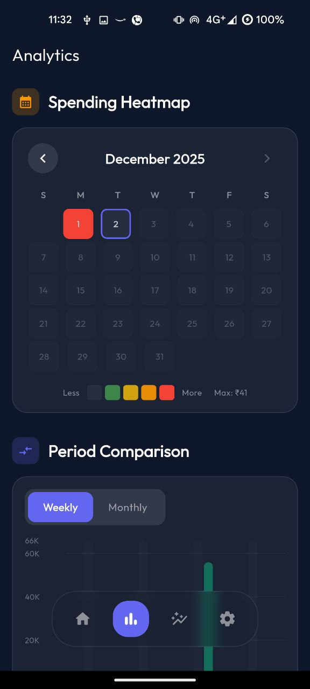
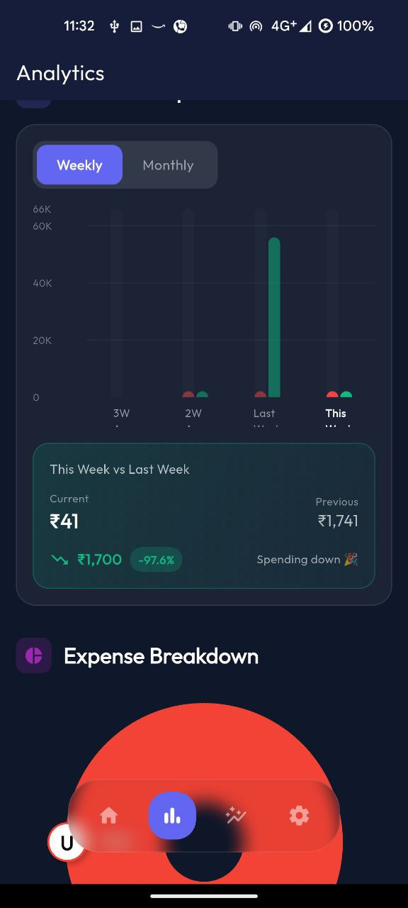
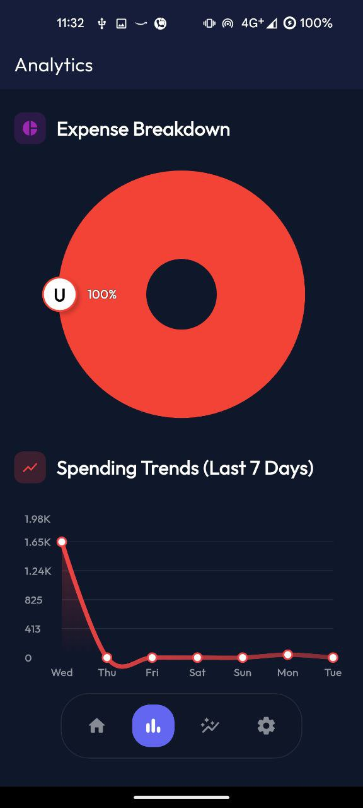
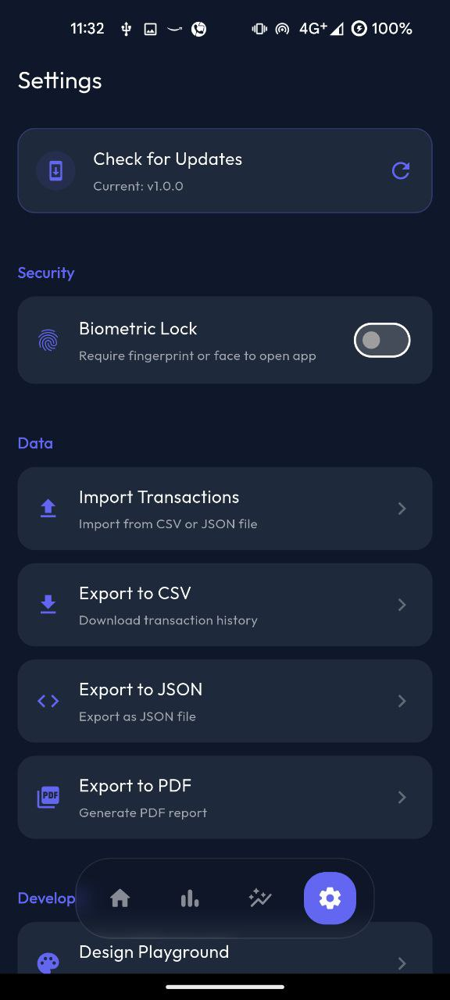

# 💰 PennyWise

**Your Smart Personal Finance Manager**

PennyWise is a comprehensive, modern expense management application built with Flutter. It combines the privacy of local storage with the convenience of cloud sync, helping you track expenses, manage budgets, monitor loans, and achieve your financial goals with a stunning, dark-themed interface.

## ✨ Key Features

### 🤖 Smart Automation
- **SMS Expense Tracking** - Automatically detects and records transaction SMS messages from banks (Local processing only for privacy).

### 💸 Complete Financial Management
- **Transaction Tracking** - Record income and expenses with ease.
- **Loan Management** - Keep track of money lent to friends (`Given`) and borrowed (`Taken`).
- **Financial Goals** - Set savings targets (e.g., "New Laptop", "Vacation") and track your progress.
- **Net Worth Overview** - Real-time calculation of your total financial health.

### 📊 Analytics & Insights
- **Interactive Charts** - Visual breakdown of spending by category.
- **Spending Trends** - Analyze your daily spending patterns.
- **Budget Planning** - Set monthly limits for specific categories and get alerts.

### ☁️ Hybrid Architecture
- **Cloud Sync** - Securely sync your data across devices using Firebase (Google Sign-In).
- **Offline Capable** - Works perfectly offline with Hive local database.
- **Privacy Focused** - SMS data is stored **locally only** and never uploaded to the cloud.

### 🎨 Premium Experience
- **Modern Dark UI** - Sleek, gradient-based design with smooth animations.
- **Customization** - Personalize your profile, currency (₹, $, €, etc.), and categories.
- **Biometric Lock** - Secure your financial data with Fingerprint/Face ID.

## 🛠️ Tech Stack

- **Framework**: Flutter 3.10+
- **Architecture**: Provider (State Management)
- **Backend**:
  - **Firebase**: Auth, Firestore (Cloud Sync), Crashlytics
  - **Hive**: Local NoSQL Database (Offline cache & SMS storage)
- **Key Libraries**:
  - `fl_chart`: For beautiful analytics graphs
  - `flutter_animate`: For smooth UI transitions
  - `flutter_sms_inbox`: For reading transaction SMS
  - `local_auth`: For biometric security
  - `google_fonts`: For modern typography

## 🚀 Getting Started

### Prerequisites
- Flutter SDK (3.10.1 or higher)
- Dart SDK
- Firebase Project (for cloud features)

### Installation

1. **Clone the repository**
   ```bash
   git clone https://github.com/Bhanu7773-dev/PennyWise.git
   cd PennyWise
   ```

2. **Install dependencies**
   ```bash
   flutter pub get
   ```

3. **Generate Hive adapters**
   ```bash
   flutter pub run build_runner build
   ```

4. **Run the app**
   ```bash
   flutter run
   ```

## 📱 Screenshots

<p align="center">
  
  
</p>

<p align="center">
  
  
</p>

<p align="center">
  
  
</p>

## 🤝 Contributing

Contributions are welcome! Please feel free to submit a Pull Request.

1. Fork the Project
2. Create your Feature Branch (`git checkout -b feature/AmazingFeature`)
3. Commit your Changes (`git commit -m 'Add some AmazingFeature'`)
4. Push to the Branch (`git push origin feature/AmazingFeature`)
5. Open a Pull Request

## 👨‍💻 Author

**Bhanu Pratap Singh**
- GitHub: [@Bhanu7773-dev](https://github.com/Bhanu7773-dev)
- Telegram: [@darkdevil7773](https://t.me/darkdevil7773)

## 🌟 Support

Give a ⭐️ if this project helped you!

---

**Made with ❤️ and Flutter**
