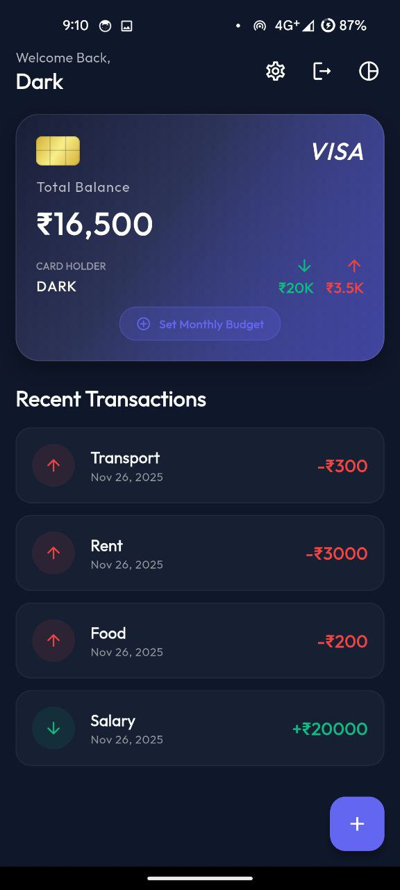
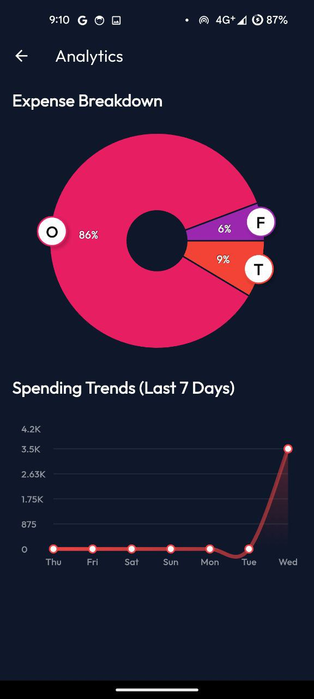
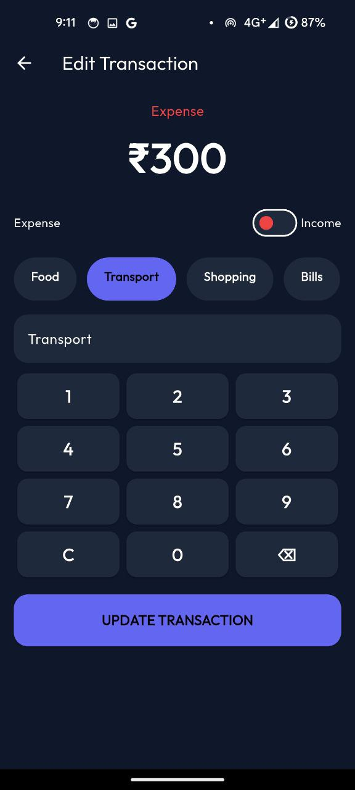
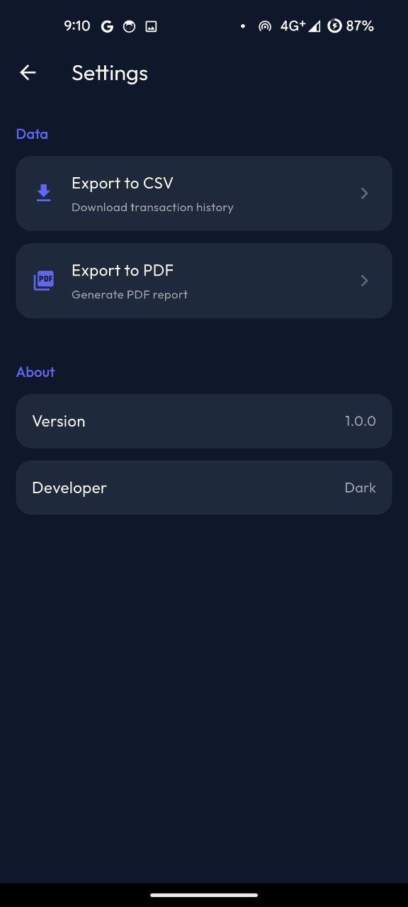

# 💰 PennyWise

**A beautiful and intuitive personal finance tracker built with Flutter**

PennyWise is a modern expense management app that helps you track your income, expenses, and budgets with a sleek dark-themed interface and powerful analytics.

## ✨ Features

### 💸 Transaction Management
- **Add & Edit Transactions** - Easily record income and expenses with custom categories
- **Transaction History** - View all your transactions sorted by date
- **Quick Actions** - Delete or update transactions with a simple tap

### 📊 Analytics & Insights
- **Expense Breakdown** - Visual pie charts showing spending by category
- **Spending Trends** - Track your daily spending patterns over the last 7 days
- **Budget Tracking** - Set monthly budgets and monitor your progress in real-time

### 🎯 Budget Management
- **Monthly Budgets** - Set spending limits for each month
- **Progress Indicators** - Visual progress bars showing how much of your budget you've used
- **Budget Alerts** - Stay informed about your spending habits

### 📱 User Experience
- **Personalized Welcome** - Customizable username and greeting
- **Multi-Currency Support** - Choose your preferred currency symbol (₹, $, €, etc.)
- **Dark Theme** - Beautiful gradient-based dark UI with smooth animations
- **Onboarding Flow** - First-time user setup experience

### 📤 Data Export
- **CSV Export** - Export transaction data to CSV format
- **PDF Reports** - Generate professional PDF transaction reports
- **Local Storage** - All exports saved to a dedicated PennyWise folder

### 🔒 Security & Privacy
- **Offline First** - All data stored locally using Hive database
- **No Cloud Dependency** - Your financial data stays on your device

## 🛠️ Tech Stack

- **Framework**: Flutter 3.10+
- **State Management**: Provider
- **Local Database**: Hive
- **Charts**: FL Chart
- **Animations**: Flutter Animate
- **Fonts**: Google Fonts
- **Authentication**: Local Auth (Biometric)

## 📦 Key Dependencies

```yaml
- provider: State management
- hive & hive_flutter: Local NoSQL database
- fl_chart: Beautiful charts and graphs
- flutter_animate: Smooth animations
- google_fonts: Custom typography
- intl: Date and number formatting
- csv & pdf: Data export functionality
- local_auth: Biometric authentication
```

## 🚀 Getting Started

### Prerequisites
- Flutter SDK (3.10.1 or higher)
- Dart SDK
- Android Studio / VS Code

### Installation

1. Clone the repository
```bash
git clone https://github.com/yourusername/PennyWise.git
cd PennyWise
```

2. Install dependencies
```bash
flutter pub get
```

3. Generate Hive adapters
```bash
flutter pub run build_runner build
```

4. Run the app
```bash
flutter run
```

## 📱 Screenshots

<p align="center">
  
  
  
</p>

<p align="center">
  
  
</p>

## 🎨 Features Highlights

- **Real-time Balance Calculation** - Automatically calculates total balance, income, and expenses
- **Category-based Tracking** - Organize transactions by categories
- **Date-based Filtering** - View transactions by specific time periods
- **Responsive Design** - Optimized for different screen sizes
- **Smooth Animations** - Delightful micro-interactions throughout the app

## 🤝 Contributing

Contributions, issues, and feature requests are welcome! Feel free to check the issues page.

## 👨‍💻 Author

**Bhanu Pratap Singh**
- GitHub: [@Bhanu7773-Dev](https://github.com/Bhanu7773-dev)
- Telegram: [@darkdevil7773](https://t.me/darkdevil7773)

## 🌟 Show your support

Give a ⭐️ if this project helped you!

---

**Made with ❤️ and Flutter**
